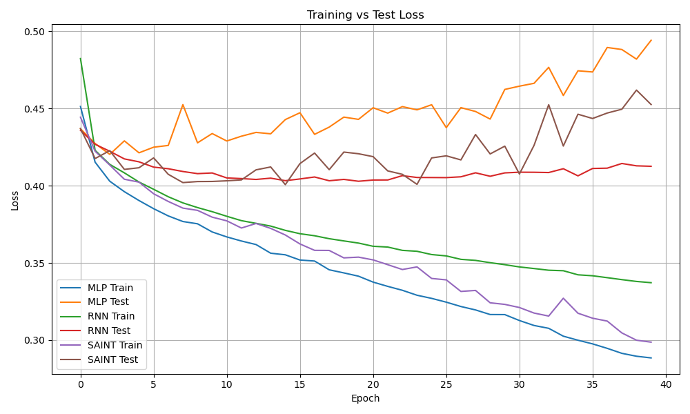
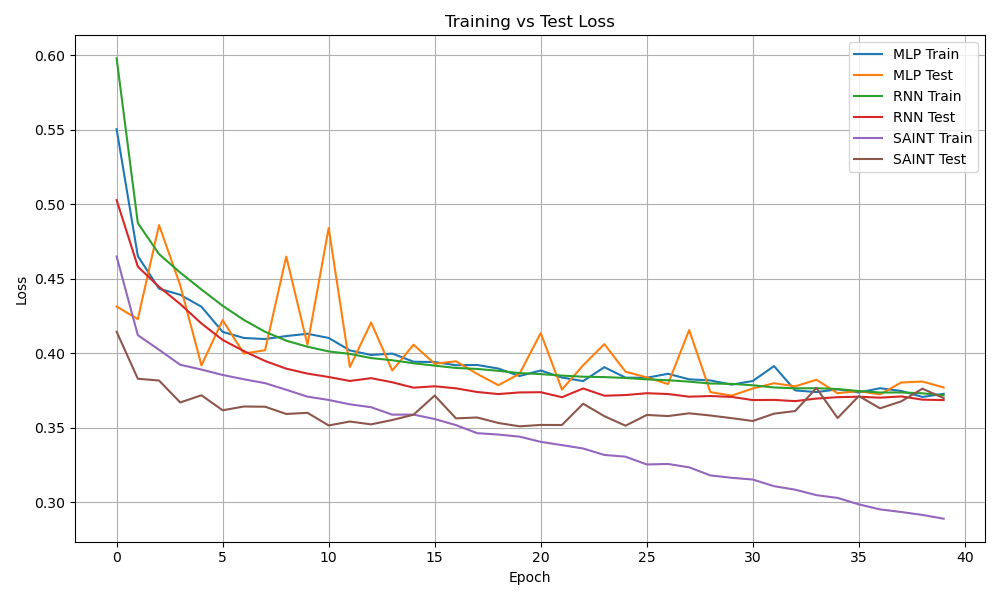

# Medical Time-Series Mortality Prediction

This project focuses on processing medical time-series data and building models to predict mortality risk.  
We compare baseline models against SAINT under both **non-time-series** and **time-series** settings.

---

## Data Preprocessing

### Without Time-Series
1. Select key features  
2. Compute the average value for each feature  
3. Impute missing values with the **median**  

### With Time-Series
1. Select key features  
2. Take the first **72 hours**, split into **2-hour intervals**  
3. Impute missing values with the **median**  

---

## Prediction Models
- **Baseline:** MLP, RNN  
- **Other:** SAINT  

---

## Experimental Results

### Without Timeline

| Model | AUC    | Accuracy | F1     | Precision | Recall |
|-------|--------|----------|--------|-----------|--------|
| MLP   | 0.8012 | 0.8253   | 0.4455 | 0.6731    | 0.3329 |
| RNN   | 0.8123 | 0.8305   | <b style="color:red">0.4782</b> | 0.6810    | <b style="color:red">0.3685</b> |
| SAINT | <b style="color:red">0.8127</b> | <b style="color:red">0.8340</b> | 0.4720 | <b style="color:red">0.7159</b> | 0.3521 |

### With Timeline

| Model | AUC    | Accuracy | F1     | Precision | Recall |
|-------|--------|----------|--------|-----------|--------|
| MLP   | 0.7994 | 0.8520   | 0.3944 | <b style="color:red">0.7689</b> | 0.2652 |
| RNN   | 0.7967 | 0.8533   | 0.4055 | 0.7692    | 0.2754 |
| SAINT | <b style="color:red">0.8219</b> | <b style="color:red">0.8607</b> | <b style="color:red">0.4819</b> | 0.7432    | <b style="color:red">0.3565</b> |

## Loss Comparison

### Without Timeline

### With Timeline

---

## Conclusion
- **SAINT** achieves the best **AUC** and **Accuracy** in both settings.  
- Incorporating time-series information further improves overall predictive performance, with improving 2~3%.  

